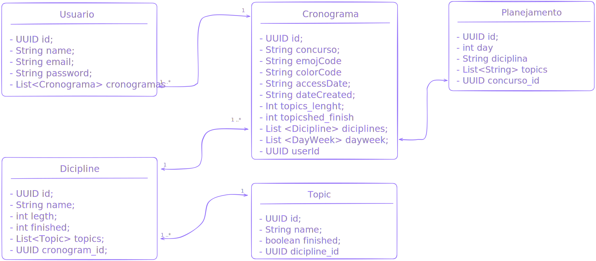

# StudyAI 🎓

é uma solução revolucionária que utiliza Inteligência Artificial para criar cronogramas de estudos personalizados e gerar bancos de questões específicos para concursos públicos. Transforme sua preparação com uma abordagem orientada por dados e adaptada ao seu edital.

## Documentação da API
[APIDOC](./backend/APIDOC.md)

## Funcionalidades ✨

### Cronograma Inteligente 📋
- Análise de Edital via IA: Processa editais completos para identificar tópicos, pesos e distribuição de conteúdo

- Planejamento Personalizado: Cria cronogramas adaptados ao seu tempo disponível, data da prova e dificuldade dos tópicos

### Banco de Questões IA 📚
- Geração de questões com IA baseadas em questões de concuros passados

## Tecnologias utilizadas 🛠️ 
- javascript
- node.js
- react.js
- express
- cors
- openai
- pdf-parser
- jsonwebtoken
-multer

## Use case

## Casses

